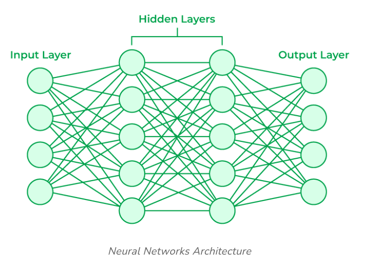
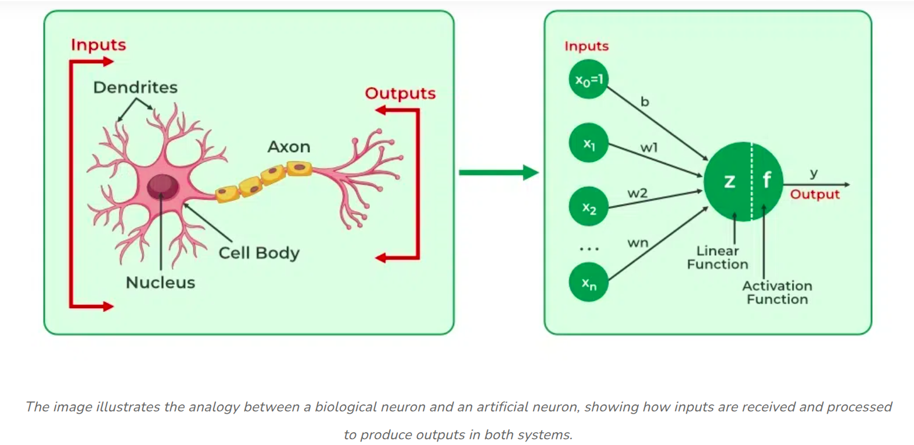
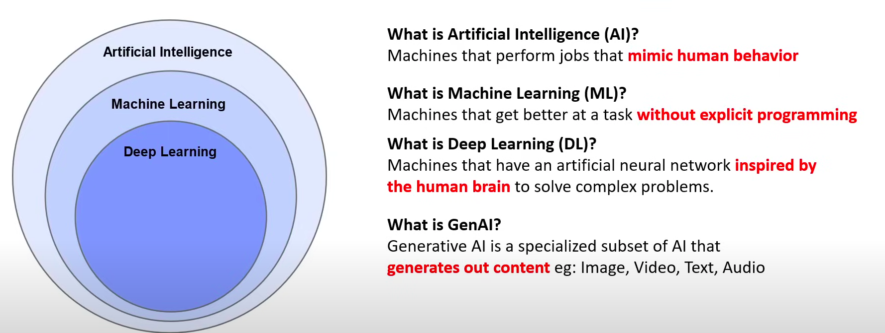
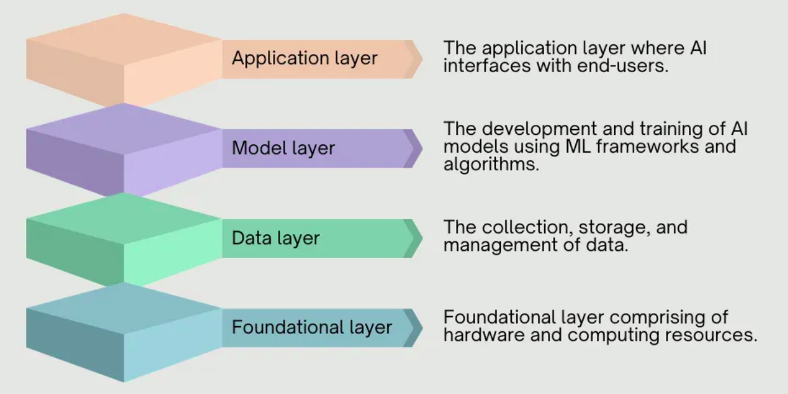

# What is Artificial Intelligence (AI)?

## Artificial Intelligence (AI)

Artificial Intelligence (AI) is a game-changing technology that allows machines to **handle problem-solving tasks traditionally done by humans**. Whether it’s identifying images, producing creative outputs, or making predictions from data, AI gives businesses the ability to scale smarter decision-making.

In the modern digital world, organizations produce enormous volumes of data from sensors, user interactions, and system logs. AI leverages this data to optimize operations — automating customer service, improving marketing efforts, and delivering actionable insights through advanced analytics.

## History of AI

In 1950, Alan Turing articulated the foundational idea of artificial intelligence in his landmark paper “[Computing Machinery and Intelligence](https://courses.cs.umbc.edu/471/papers/turing.pdf),” where he examined whether machines could emulate human thought processes. Although Turing established the theoretical basis, the evolution of modern AI has been driven by decades of innovation, built upon the collaborative contributions of scientists and engineers advancing the discipline across diverse domains of research and technology.

**1940–1980**  
In 1943, [Warren McCulloch](https://en.wikipedia.org/wiki/Warren_Sturgis_McCulloch) and [Walter Pitts](https://en.wikipedia.org/wiki/Walter_Pitts) introduced the idea of artificial neurons — an early concept that later became the basis of neural networks, a key technology behind AI.

A few years later, in 1950, Alan Turing published *“[Computing Machinery and Intelligence](https://courses.cs.umbc.edu/471/papers/turing.pdf)”* where he proposed the famous **Turing Test** — a way to check if a machine could “think” like a human.

During the 1950s and 60s, progress came quickly:

* Marvin Minsky and Dean Edmonds built [**SNARC**](https://en.wikipedia.org/wiki/Stochastic_Neural_Analog_Reinforcement_Calculator), the first machine based on neural networks.
* Frank Rosenblatt developed the [**Perceptron**](https://en.wikipedia.org/wiki/Perceptron), one of the earliest models of a neural network.
* Joseph Weizenbaum created [**ELIZA**](https://en.wikipedia.org/wiki/ELIZA), an early chatbot that could mimic a conversation with a therapist.

However, from 1969 to 1979, Marvin Minsky showed the **limitations** of neural networks at the time. Combined with weak hardware and limited funding, this led to the first **“AI winter”** — a period when interest and investment in AI dropped significantly.

**1980–2006**  
The 1980s saw a renewed wave of interest in AI, supported by government funding and research initiatives, particularly in domains such as translation and speech recognition. During this period, expert systems like **MYCIN** gained attention for replicating human decision-making in specialized areas such as medicine. Neural networks also experienced a revival, with influential contributions from [**David Rumelhart**](https://en.wikipedia.org/wiki/David_Rumelhart) and [**John Hopfield**](https://en.wikipedia.org/wiki/John_Hopfield), who demonstrated through early deep learning methods that computers could improve performance by learning from experience.

Between 1987 and 1997, however, socio-economic shifts — including the dot-com era — triggered a second **“AI winter,”** during which progress slowed and research fragmented due to reduced commercial viability.

Momentum returned in 1997, when [**IBM’s Deep Blue**](https://en.wikipedia.org/wiki/Deep_Blue_(chess_computer)) defeated world chess champion **Garry Kasparov**, a landmark event that showcased AI’s potential. Around the same time, [**Judea Pearl’s**](https://en.wikipedia.org/wiki/Judea_Pearl) advancements in probability and decision theory broadened AI’s theoretical foundation, while **Geoffrey Hinton** and others renewed focus on deep learning, paving the way for a resurgence in neural network research. Although large-scale commercial adoption was still emerging, these breakthroughs established the groundwork for AI’s next era of growth.

**2007–Present**  
Between 2007 and 2018, the rise of cloud computing significantly lowered the barrier to accessing large-scale computational power and AI infrastructure, accelerating the adoption and innovation of machine learning technologies. Notable milestones included the development of [**AlexNet**](https://en.wikipedia.org/wiki/AlexNet), a [convolutional neural network (CNN)](https://www.geeksforgeeks.org/machine-learning/introduction-convolution-neural-network/) created by Alex Krizhevsky, Ilya Sutskever, and Geoffrey Hinton, which won the ImageNet competition and demonstrated the transformative potential of deep learning in image recognition. Another breakthrough came with [**Google’s AlphaZero**](https://en.wikipedia.org/wiki/AlphaZero), which mastered complex games such as chess, shogi, and Go entirely through self-play, without relying on human data.

In 2022, artificial intelligence entered mainstream awareness with the release of conversational AI systems like **OpenAI’s ChatGPT**. By combining advanced machine learning and natural language processing (NLP), these systems engaged in human-like dialogue and task completion, reigniting global interest in AI research, applications, and development.

## Neural Networks

A **neural network** is a computational model inspired by the structure of the human brain. It’s made up of many interconnected nodes (called *artificial neurons*) organized into layers. By passing data through these layers, the network can learn complex relationships and make predictions.

[Image source](https://www.geeksforgeeks.org/artificial-intelligence/artificial-neural-networks-and-its-applications/)

[Image source](https://www.geeksforgeeks.org/machine-learning/neural-networks-a-beginners-guide/)

Neural networks are widely used in tasks like image recognition, speech processing, and natural language understanding because they can approximate nonlinear functions and extract hidden patterns from data.

### Artificial Neurons

An **artificial neuron** is a mathematical function that mimics the way a biological neuron processes signals:

1. **Inputs** – The neuron receives one or more inputs (e.g., numbers representing pixel brightness).
2. **Weights** – Each input is multiplied by a weight, which represents its importance.
3. **Summation** – The weighted inputs are added together.
4. **Activation function** – The result is passed through a nonlinear function (like [sigmoid](https://www.geeksforgeeks.org/machine-learning/derivative-of-the-sigmoid-function/), [ReLU](https://www.geeksforgeeks.org/deep-learning/relu-activation-function-in-deep-learning/), or [tanh](https://www.geeksforgeeks.org/deep-learning/tanh-activation-in-neural-network/)) to decide whether the neuron “fires” and how strongly.
5. **Output** – The neuron sends this result to the next layer.

### Layers in a Neural Network

* **Input layer** – Raw data enters (features like pixels, words, or sensor readings).
* **Hidden layers** – Multiple layers of neurons transform the inputs step by step, detecting features and patterns.
* **Output layer** – Produces the final result (classification, probability, prediction).

Example:  
To classify whether an image shows a cat or a dog:

* Input layer: each pixel value enters the network.
* Hidden layers: neurons combine pixels into edges, edges into shapes, shapes into features like “ears” or “fur texture.”
* Output layer: a probability score — e.g., 0.9 for “cat,” 0.1 for “dog.”

## What Is the Difference Between Artificial Intelligence, Machine Learning, and Deep Learning?

In recent years, AI has surged into the spotlight thanks to breakthroughs like conversational chatbots (e.g., OpenAI’s ChatGPT), which renewed global interest and accelerated development. But while the terms **artificial intelligence (AI)**, **machine learning (ML)**, and **deep learning (DL)** are often used interchangeably, they are not the same thing. Instead, they represent different layers within a hierarchy of technologies.

[Image source](https://www.youtube.com/watch?v=WZeZZ8_W-M4)

### Artificial Intelligence (AI): The Umbrella Concept

Artificial Intelligence is the broadest field. It is an umbrella term for strategies and techniques designed to make machines act more human-like. AI includes everything from **self-driving cars** and **robotic vacuum cleaners** to **smart assistants** like Alexa or Siri.

Importantly, not all AI is based on learning. Traditional AI also includes **rule-based systems** and expert systems that rely on predefined logic. At the same time, modern **generative AI** — a very advanced form of deep learning — demonstrates human-like creativity by generating text, images, or even music.

**Key takeaway:** AI is the overall vision of making machines act intelligently, and both ML and DL fall under this broader category.

### Machine Learning (ML): Learning from Data

Machine Learning is a **subset of AI**. While AI is the broader concept, ML is specifically about designing **algorithms and statistical models** that allow computers to learn from data instead of being explicitly programmed.

ML systems analyze large volumes of historical data, detect patterns, and use those patterns to make predictions or decisions. For example:

* An **email spam filter** learns from examples of spam and legitimate emails.
* An **e-commerce recommendation system** suggests items by analyzing customer behavior.

In practice, ML can be used independently or as the foundation for more advanced AI techniques, such as deep learning.

**Key takeaway:** ML is how machines recognize patterns and improve their performance through experience.

### Deep Learning (DL): Neural Networks at Scale

Deep Learning takes machine learning one step further. It relies on **artificial neural networks**, which are computational structures inspired by the human brain. These networks are built from millions of interconnected software components that each perform tiny mathematical operations. When combined, they can solve highly complex problems.

For instance:

* A deep learning model can process **individual pixels** in an image to recognize objects.
* It can power **voice recognition** and **language translation** systems.
* Modern generative AI models use deep neural networks to write poems, answer questions, or create images from text prompts.

Some of the most significant AI breakthroughs — such as **AlexNet’s success in image recognition** or **Google’s AlphaZero mastering chess, shogi, and Go through self-play** — have come from deep learning.

**Key takeaway:** DL is a specialized branch of ML that enables today’s most powerful AI applications.

### Putting It All Together

You can think of their relationship as a hierarchy:

* **AI** – The broad concept of making machines intelligent.
* **ML** – A subset of AI where machines learn from data using algorithms and statistical models.
* **DL** – A specialized subset of ML that uses deep neural networks to learn from massive and complex datasets.

## How Does AI Work?

Artificial Intelligence (AI) systems transform raw data — whether text, images, audio, or video — into meaningful insights. At the core, AI identifies **patterns and relationships** within data, enabling machines to make informed decisions at scale.

AI models are trained on vast datasets, improving continuously over time. Much like humans learn from experience, AI systems refine their performance with each interaction, becoming more accurate and reliable. This adaptability is what drives innovation and opens new opportunities across industries, from healthcare to finance to entertainment.

| **Domain**                            | **What It Does**                                                                 | **Real-World Examples**                                                                 |
| ------------------------------------- | -------------------------------------------------------------------------------- | --------------------------------------------------------------------------------------- |
| **Neural Networks**                   | Core computational structures that mimic the brain; process inputs into patterns | Image recognition, fraud detection, recommendation engines                              |
| **Natural Language Processing (NLP)** | Enables machines to understand, interpret, and generate human language           | ChatGPT, document summarization, sentiment analysis, translation apps                   |
| **Computer Vision**                   | Analyzes and extracts meaning from images and video                              | Facial recognition, medical imaging diagnostics, self-driving cars, content moderation  |
| **Speech Recognition**                | Converts spoken words into text and interprets meaning/sentiment                 | Siri, Alexa, Google Assistant, live transcription, call center automation               |
| **Generative AI**                     | Creates new content (text, images, audio, video) using deep learning             | ChatGPT (text), DALL·E & Stable Diffusion (images), AI music and video generation tools |

### Neural Networks: The Core of AI

At the heart of modern AI lie **artificial neural networks (ANNs)**, computational structures inspired by the human brain.

* A biological brain processes information using billions of neurons.
* An artificial neural network uses layers of **artificial neurons (nodes)** that perform mathematical operations on inputs and pass the results forward.

Through this process, networks can model highly complex relationships. For example:

* The first layer might detect edges in an image.
* Deeper layers combine those edges into shapes, then into objects.

This layered learning makes neural networks powerful for tasks such as image recognition, natural language processing, and generative AI.

### Natural Language Processing (NLP): Understanding Human Language

**Natural Language Processing (NLP)** allows machines to interpret and generate human language. Using neural networks — particularly transformer-based models like GPT — NLP systems can:

* Summarize documents.
* Power chatbots and virtual assistants.
* Analyze sentiment in text (positive, negative, neutral).

NLP techniques involve analyzing grammar, context, and meaning. They enable machines to not just process words but also understand relationships between them, allowing for coherent text generation and human-like conversations.

### Computer Vision: Seeing the World

**Computer vision** enables AI to extract meaning from images and videos. By applying **deep learning models** such as convolutional neural networks (CNNs), AI systems can:

* Detect and classify objects.
* Recognize faces.
* Moderate online content.
* Guide autonomous vehicles by interpreting real-time visual data.

Because visual recognition often requires **split-second decisions** (e.g., a self-driving car recognizing a stop sign), computer vision systems rely on highly optimized deep learning architectures.

### Speech Recognition: From Voice to Text

**Speech recognition** converts spoken language into text while also interpreting meaning and tone. Neural networks analyze sound waves, segment them into phonemes (basic sound units), and then map them to words.

Applications include:

* Virtual assistants (e.g., Siri, Alexa).
* Real-time transcription services.
* Call center automation that detects intent and sentiment.

Modern speech recognition leverages recurrent neural networks (RNNs), attention mechanisms, and transformers to improve accuracy across different accents and noisy environments.

### Generative AI: Creating New Content

**Generative AI** marks a leap forward in AI’s evolution. Unlike traditional AI, which primarily analyzed data, generative AI systems can **create new content**:

* Text (e.g., ChatGPT).
* Images (e.g., DALL·E, Stable Diffusion).
* Audio and video.

These systems are powered by deep learning models trained on massive datasets. They use probabilistic methods to generate outputs that are original but consistent with training patterns.

Generative AI enables exciting applications — from design automation to creative writing — but it also raises challenges around **bias, misinformation, and intellectual property**.

AI is not a single technology but a collection of interrelated fields:

* **Neural networks** provide the computational backbone.
* **NLP** allows machines to process and generate language.
* **Computer vision** gives AI the ability to see.
* **Speech recognition** enables machines to listen and respond.
* **Generative AI** empowers them to create.

## AI vs. Generative AI: What’s the Difference?

**Artificial Intelligence (AI)** is the broad field of computer science focused on building systems that can perform tasks requiring human-like intelligence. These tasks include decision-making, pattern recognition, speech understanding, image classification, and problem-solving. AI covers a wide spectrum of technologies—from rule-based expert systems of the past to modern machine learning and deep learning models.

**Generative AI (GenAI)** is a **specialized branch of AI**. Unlike traditional AI systems that primarily analyze data, recognize patterns, or make predictions, generative AI creates *new* content. Using advanced deep learning architectures (often large language models or diffusion models), it can generate text, images, audio, video, or even code.

### Key Distinction

* **AI in general**: Makes machines act intelligently — analyzing data, automating tasks, and supporting decisions.
* **Generative AI**: Goes beyond analysis to *produce original outputs* that resemble human creativity.

### Examples

* **AI**: A spam filter that classifies emails, a medical diagnostic tool that flags anomalies in scans, or a chatbot that follows predefined rules.
* **Generative AI**: ChatGPT writing essays, DALL·E creating images from text prompts, or AI tools composing music.

In short, **AI is the umbrella concept**, while **Generative AI is a breakthrough subfield** that enables machines not just to understand the world, but to create new artifacts within it.

| **Aspect**     | **Artificial Intelligence (AI)**                                 | **Generative AI (GenAI)**                                    |
| -------------- | ---------------------------------------------------------------- | ------------------------------------------------------------ |
| **Purpose**    | Perform tasks requiring intelligence (analyze, classify, decide) | Create new content (text, images, audio, video, code)        |
| **Data Use**   | Learns from data to make predictions or decisions                | Learns from data to generate new, original outputs           |
| **Techniques** | Rule-based systems, ML models, deep learning                     | Large language models (LLMs), diffusion models, transformers |
| **Examples**   | Spam filters, fraud detection, medical diagnosis tools           | ChatGPT, DALL·E, Stable Diffusion, AI music and video tools  |
| **Output**     | Insights, classifications, decisions                             | Creative artifacts resembling human work                     |

## Key Components of AI Application Architecture

An effective AI application relies on a layered architecture, supported by robust IT infrastructure that provides the compute power and memory needed to run AI systems at scale. This architecture is typically organized into **three core layers**, each playing a critical role in transforming raw data into intelligent, customer-facing applications.

[Image source](https://medium.com/@donaldharmitt/cracking-ais-competitive-code-what-it-takes-to-win-at-the-application-layer-834dab144775)

### **1. Data Layer: The Foundation of AI**

Every AI system begins with **data**. This layer is responsible for collecting, organizing, and preparing data for AI applications. It ensures that the information — whether text, images, audio, or sensor readings — is clean, structured, and ready for processing.

Since AI technologies such as **machine learning, natural language processing, and computer vision** all rely on high-quality data, the data layer forms the essential foundation of the architecture.

### **2. Model Layer: The Intelligence Engine**

The model layer powers AI decision-making. Today, this often means using **foundation models** or **large language models (LLMs)** — deep learning systems trained on vast amounts of generalized, unlabeled data. These models are capable of performing a wide range of tasks, from generating text to interpreting images, based on input prompts.

Organizations can take pre-trained foundation models and **fine-tune them with internal data** to adapt the model to specific business needs. This approach adds AI capabilities to existing applications or supports the development of entirely new ones.

It’s important to note that traditional **machine learning models** are still widely used. In fact, for certain tasks, ML models can outperform foundation models, giving developers flexibility to choose the right tool for the right use case.

### **3. Application Layer: The User Interface**

The application layer is the **customer-facing part** of AI architecture. It’s where end users interact with AI systems — asking questions, generating content, or making data-driven decisions.

Through this layer, AI delivers value directly to people, powering everything from chatbots and recommendation systems to advanced analytics dashboards and creative tools.

Together, these three layers — **data, model, and application** — create a pipeline that transforms raw data into intelligent insights and actions, enabling organizations to operationalize AI at scale.

## AI Modality and the Confusion with LLMs

One of the most important concepts in artificial intelligence is [**modality**](https://en.wikipedia.org/wiki/Multimodal_learning) — the type of data an AI system is designed to handle. Just as humans rely on different senses such as vision, hearing, and language, AI systems are trained to process specific forms of input and output.

* **Unimodal AI** works with a single data type, such as text-only chatbots or image classifiers.
* **Multimodal AI** integrates multiple forms of data, such as combining text, images, and speech to deliver richer interactions. For instance, a multimodal system might analyze a photo and a written question together to generate a meaningful response.

This is where confusion often arises with **Large Language Models (LLMs)**. LLMs, like GPT, are trained primarily on text data, which makes them **unimodal**. Their strength lies in processing and generating language. However, many modern AI systems extend LLMs with capabilities like image or audio understanding. These are then referred to casually as LLMs, even though they are technically **multimodal models built on top of an LLM foundation**.

The distinction matters:

* **LLMs are not synonymous with AI** — they are one branch under the broader AI umbrella.
* **Modality defines scope** — understanding what data a model can work with helps set realistic expectations.
* **Multimodal AI represents the frontier** — bringing together vision, speech, and language to better reflect how humans perceive and interact with the world.

| **Type**                         | **Modality**                                     | **Strengths**                                                                   | **Examples**                                   |
| -------------------------------- | ------------------------------------------------ | ------------------------------------------------------------------------------- | ---------------------------------------------- |
| **Large Language Models (LLMs)** | Text only (unimodal)                             | Natural language understanding, text generation, summarization, Q\&A            | GPT, Claude, LLaMA                             |
| **Multimodal AI**                | Multiple data types (text, images, audio, video) | Combines inputs for richer context, enables vision + language or speech + text  | GPT-4 with vision, Gemini, CLIP, Whisper + LLM |
| **General AI (AGI)**             | All modalities (like human senses)               | Theoretical goal: reason, learn, and adapt across any domain without retraining | Not yet achieved                               |

## References
- [AWS Docs: What Is Artificial Intelligence (AI)?](https://aws.amazon.com/what-is/artificial-intelligence/)
- [What is a Neural Network?](https://aws.amazon.com/what-is/neural-network/)