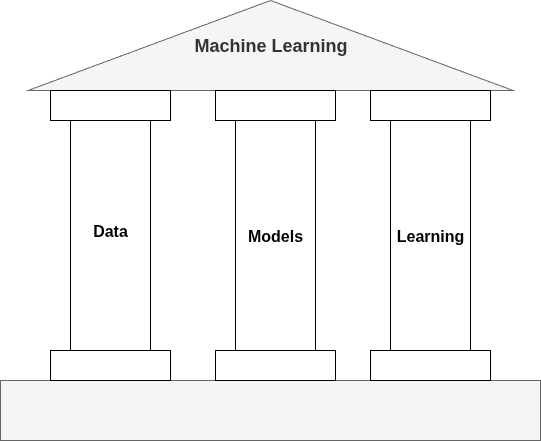

# The Three Pillars of Machine Learning: Data, Model, and Learning

At its core, machine learning is not magic. It is a systematic process built on three fundamental components: **data, models, and learning**. Understanding these pillars makes it easier to see how machine learning works and why it is so powerful in solving problems across industries.

The first and most crucial component is **data**. Machine learning is inherently data-driven, meaning that without data there is nothing to learn from. Unlike traditional programming, where humans explicitly define every rule, machine learning systems infer rules from examples. If you imagine teaching a child to recognize animals, you do not explain every detail about fur, paws, or tails. Instead, you show many pictures, and over time, the child begins to notice the patterns. In the same way, data provides the raw material from which a machine can discover patterns and make predictions. Whether it is millions of books in a library, thousands of X-ray scans, or terabytes of customer transactions, the **quality and quantity of data determine how well a system can learn**.

The second component is the **model**. A model is a **mathematical structure (algorithm) that represents the process generating the data**. In simple terms, it is the computer’s way of describing the relationship between inputs and outputs. For example, in a regression setting, the model attempts to map inputs like years of experience or level of education to an output such as salary. Models can take many forms, from simple linear functions to highly complex neural networks. What they all share in common is that they provide a structured way to **capture the patterns present in the data**.

The third component is **learning**, the **process of improving the model based on the data it sees**. Learning happens by **optimizing the parameters of the model** — fine-tuning them step by step until the model’s predictions align more closely with reality. This is similar to how a student gets better at solving math problems with practice. Each new example offers feedback, and over time the student’s performance improves. In the same way, a machine learning model improves as it processes more data and adjusts its internal parameters.

The true measure of success lies in how well a model can **generalize**. It is not enough for the system to perform well on the data it has already seen; it **must also handle new, unseen data with accuracy**. A model that memorizes the training set may appear impressive at first, but it fails the moment it encounters something different. Generalization **ensures that the insights captured are not tied only to the past but are useful for the future**.

Together, these three components — **data**, **model**, and **learning** — form the foundation of machine learning. Data provides the examples, the model offers a framework to represent the relationships, and learning is the mechanism that brings the two together to create intelligence. When these elements are carefully balanced, machine learning systems can uncover hidden patterns, adapt to new situations, and make reliable predictions.

In essence, machine learning is about transforming raw data into actionable knowledge. By combining the richness of data with the structure of models and the adaptive power of learning, we create systems that improve over time and help solve problems in ways that traditional programming never could.