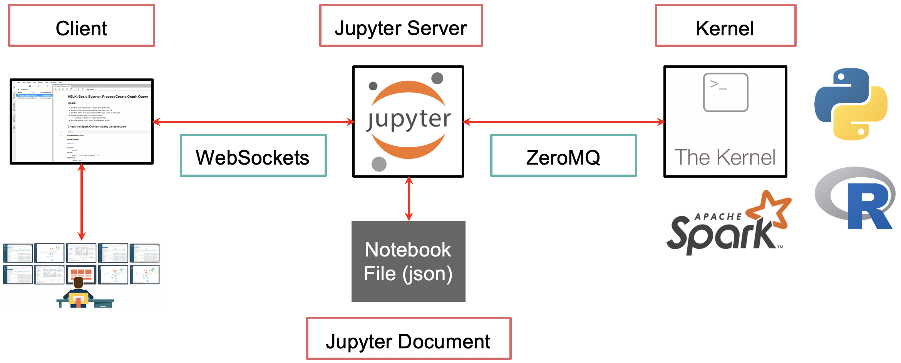

# Jupyter Notebooks Basics

## Python Execution Modes

### a) **Interactive Python in terminal**

* When you just type `python` (or `python3`) in your terminal, you get an **interactive shell** (also called [REPL: Read–Eval–Print Loop](https://realpython.com/python-repl/)).
* You can type Python code line by line, and it will immediately run and return output.
* Good for quick testing, but:

  * Commands aren’t saved.
  * Hard to organize larger code.
  * Poor for documentation or visualization.

### b) **Python Script File**

* Instead of typing commands interactively, you write them in a `.py` file:

  ```python
  # hello.py
  print("Hello, world!")
  ```
* Run with:

  ```bash
  python hello.py
  ```
* Pros:

  * Reusable, structured code.
  * Can be version controlled.
* Cons:

  * No immediate feedback.
  * Not interactive.

### c) **IPython (Interactive Python)**

* An enhanced interactive shell for Python.
* You install it with:

  ```bash
  pip install ipython
  ```
* Advantages over plain `python` REPL:

  * Tab completion
  * Syntax highlighting
  * Magic commands (e.g., `%timeit`, `%matplotlib inline`)
  * Better error messages
* Great for scientific computing, but still text-only.

For more information, see [ipython.org](https://ipython.org/)

### d) **Jupyter Notebooks**

* [Jupyter](https://jupyter.org/) = “Julia, Python, R” (originally created for Python, later extended to many languages).
* It combines:

  * **Code cells** (executable code)

    

  * **Markdown/text cells** (formatted text, math via LaTeX, documentation)

    

  * **Output cells** (tables, charts, visualizations)
* Created because scientists, researchers, and data analysts needed:

  * Reproducible research
  * Code + results + explanation in one place
  * Interactive exploration with plots
* File format: `.ipynb` (JSON under the hood)

## Why Jupyter Was Created

* Traditional `.py` scripts or REPL aren’t good for:

  * Mixing narrative (explanation) with code.
  * Keeping track of experiments.
  * Sharing work in an easy-to-read format.
* Jupyter solved this by creating a **literate programming environment**:

  * You can run code in chunks (cells).
  * Immediately see results, including rich media (plots, images, HTML).
  * Share notebooks with others (via GitHub, [nbviewer](https://nbviewer.org/), [JupyterHub](https://jupyterhub.readthedocs.io/en/stable/)).

## How to Install Jupyter Notebooks

You can install Jupyter in several ways:

### Option 1: Using `pip`

```bash
pip install notebook
```

Then run:

```bash
jupyter notebook
```

### Option 2: Using `conda`

If you use Anaconda:

```bash
conda install jupyter
```

### Option 3: JupyterLab (modern interface)

```bash
pip install jupyterlab
jupyter lab
```

For more information, see [Installing Jupyter](https://jupyter.org/install).

## How Jupyter Works Under the Hood

When you start Jupyter Notebook:



[Image source](https://threathunterplaybook.com/tutorials/jupyter/introduction.html)

1. **Notebook (Jupyter) server starts**

   * Runs locally as a web server (on `http://localhost:8888/` by default).
   * Manages files and notebooks.
   * Uses JSON `.ipynb` files to store code, text, and output.

2. **Kernel is launched**

   * The kernel is a separate process that executes your code (e.g., Python kernel).
   * You can also use R, Julia, Scala, etc. via different kernels.

3. **Browser-based UI (Client)**

   * You interact with the notebook through your web browser.
   * Each cell you run sends code to the kernel.
   * Kernel executes the code and sends results (text, images, plots) back to the notebook.

4. **Communication via ZeroMQ & JSON**

   * Notebook server <--> Kernel communication is done with a messaging protocol ([ZeroMQ](https://en.wikipedia.org/wiki/ZeroMQ)).
   * Inputs, outputs, errors, and execution state are serialized as JSON messages.

## Workflow Comparison

| Mode             | Good for…                        | Limitations                          |
| ---------------- | -------------------------------- | ------------------------------------ |
| Python REPL      | Quick tests, 1 – 2 line of code  | No history, no docs                  |
| Script (`.py`)   | Production code, automation      | No interactivity                     |
| IPython          | Exploratory coding in terminal   | Text-only, no docs                   |
| Jupyter Notebook | Data science, teaching, research | Can get messy, harder for production |

Start with Python REPL --> use `.py` for scripts --> graduate to IPython for interactive dev --> use Jupyter for exploration, visualization, and storytelling.

## Google Colab (Colaboratory)

**What it is:**

* A [free cloud service by Google](https://colab.google/) that lets you run **Jupyter Notebooks** in your browser.
* No installation needed; everything runs on Google’s servers.
* You just need a Google account.


**Key features:**

* **Free GPUs and [TPUs](https://en.wikipedia.org/wiki/Tensor_Processing_Unit)**: Colab gives free access to NVIDIA GPUs and TPUs (time-limited).
* **Google Drive integration**: You can save notebooks directly to your Google Drive.
* **Preinstalled libraries**: Many popular Python packages (NumPy, TensorFlow, PyTorch, etc.) are already installed.
* **Sharing**: Works like Google Docs — you can share notebooks with others (view/edit).
* **Persistent storage**: Temporary runtime (files are lost after session ends) but you can mount Google Drive for persistence.

**Use cases:**

* Machine learning experiments.
* Teaching and tutorials.
* Quick prototyping of Python code.

## Kaggle Notebooks

**What it is:**

* A [free online environment](https://www.kaggle.com/code) provided by **Kaggle** (Google-owned platform for data science competitions).
* Similar to Jupyter and Colab, but with stronger focus on **datasets and competitions**.

**Key features:**

* **Free GPUs** (like Colab, with limits).
* **Kaggle Datasets integration**: You can directly import huge datasets from Kaggle’s repository.
* **Kaggle Competitions**: Notebooks are the main way to participate (train models, generate submissions).
* **Preloaded environment**: Already set up with ML/data libraries (TensorFlow, PyTorch, scikit-learn, etc.).
* **Public sharing**: You can publish your notebook, others can fork it, comment, and learn.
* **Versioning**: Notebooks keep track of runs/versions, useful in competition workflows.

**Use cases:**

* Competing in Kaggle ML challenges.
* Exploring public datasets.
* Sharing reproducible ML workflows.

## Similarities

Both:

* Run in the cloud (no local install needed).
* Use Jupyter Notebook-style interface.
* Offer free compute resources (CPU/GPU/TPU).
* Let you mix code, text (Markdown), and output.

## Differences (Quick Table)

| Feature         | Google Colab                         | Kaggle Notebooks                          |
| --------------- | ------------------------------------ | ----------------------------------------- |
| **Ownership**   | Google Research                      | Kaggle (subsidiary of Google)             |
| **Main focus**  | General ML/AI prototyping & teaching | Competitions, datasets, community sharing |
| **Datasets**    | Must upload or mount Google Drive    | One-click access to Kaggle Datasets       |
| **Sharing**     | Like Google Docs                     | Kaggle public/private notebooks           |
| **Versioning**  | Manual (copy notebooks)              | Built-in version history per run          |
| **Environment** | Temporary VM, customizable via pip   | Preconfigured with ML stack               |
| **Community**   | Focus on collaboration and tutorials | Focus on competitions & leaderboards      |


* **Google Colab** is best if you want a quick, flexible Jupyter Notebook in the cloud with Drive integration.
* **Kaggle Notebooks** are best if you’re working with Kaggle datasets or joining ML competitions.

## Keyboard Shortcuts for Local JupyterLab Notebooks

- `Shift + Enter` - execute cell line by line
- `Ctrl + Enter` - run cell and stay in it
- `J` - move downwards (or use arrow keys)
- `K` - move upwards (or use arrow keys)
- `Enter` - edit the cell
- `ESC` - exit from the edit focus of the cell
- `A` - add cell above the cell you're currently on
- `B` - add cell below the cell you're currently on
- `dd` - delete the cell
- `y` - change type to code
- `m` - change type to markdown

## References
- [YouTube: Jupyter Notebook Complete Beginner Guide](https://www.youtube.com/watch?v=5pf0_bpNbkw)